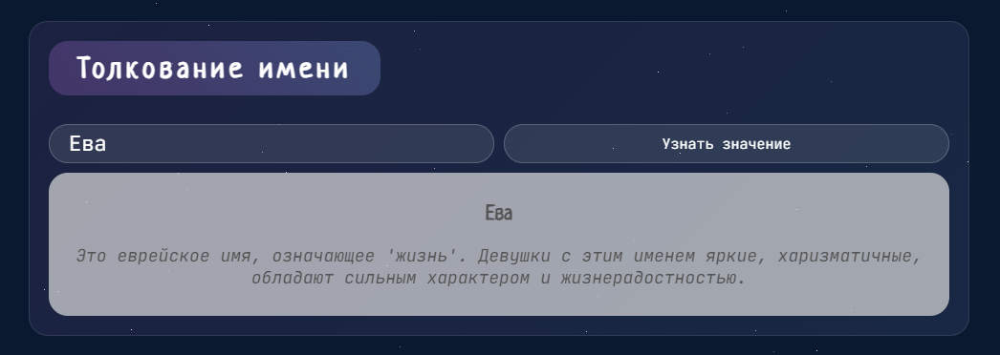

# Астрологический Портал

## Описание 

Этот проект представляет собой интерактивную страницу, которая позволяет узнать свой гороскоп, получить карту дня, раскрыть значение имени и прочитать увлекательные статьи на астрологическую тему. Сочетая современный веб-дизайн с динамичным интерфейсом, проект предлагает уникальный опыт погружения в мир астрологии и самопознания. Адаптивный дизайн гарантирует корректное отображение и удобное использование на всех устройствах, от мобильных телефонов до настольных компьютеров. 


## Стек

- **HTML5**
- **CSS3**
- **JavaScript**
- **Webpack**

## Структура проекта

- `src/ `— исходные файлы проекта.
- `src/components/` — папка с JS компонентами.
- `src/images/` — папка с изоображениями.
- `src/index.html` — HTML-файл главной страницы.
- `src/index.js` —  файл с основным кодом.
- `src/pages/index.css` —  файл с основным кодом CSS.

- `src/utils/utils.js` —  файл с утилитами.

## Инструкция по запуску

1. Скачайте или клонируйте репозиторий.
2. Выполните команды в терминале
```
npm install
npm run start
```

В проекте имеется сборка Webpack в двух вариантах:
- **build** - для сборки проекта
- **start** - для локальной разработки и просмотра

#### Ссылка на репозиторий:
```https://github.com/PolliSun/astrological-portal.git```

## Реализованный функционал

- Вы можете выбрать любой знак зодиака и получить для него уникальный гороскоп. Всего для каждого знака предусмотрено 9 вариантов. При повторном нажатии прогноз не меняется, пока вы не обновите страницу.
- Нажимая на кнопку, можно случайно получить карту дня. Карта выбирается из набора из 22 карт Таро и сопровождается тремя разными описаниями. Чтобы получить новую карту, нужно обновить страницу.
- Просто введите имя в специальное поле и нажмите кнопку, чтобы увидеть его значение. В базе есть толкования для 71 имени (мужских и женских).
- Первая статья загружается автоматически. Чтобы прочитать больше, можно нажать кнопку. Все статьи имеют свои уникальные описания.

## Что сделано

- Реализована функция для загрузки данных о знаках зодиака из файла `horoscopes.json`. Информация отображается в специальном шаблоне `<template id="horoscope-template">` с использованием JavaScript.
- Для каждого из 12 знаков доступно 9 уникальных гороскопов. Гороскоп генерируется нажатием на знак зодиака, а результат фиксируется на текущей сессии. При повторном нажатии показывается тот же гороскоп до перезагрузки страницы.

- Написана функция для случайной генерации карты дня. Карты и их описания загружаются из файла `cards.json`. Карта дня выводится в элемент `<article class="card__item">` с использованием JavaScript.
- Имеется 22 карты Таро (Старшие Арканы). Каждая карта имеет три уникальных описания, которые показываются при её генерации. Для получения новой карты требуется обновить страницу.

- Добавлена функция для поиска значений имен с загрузкой данных из файла `names.json`. Описание имени выводится в блок `<div class="display display-name">`. 
- В базе доступно 35 женских и 36 мужских имен, каждое с уникальным и индивидуальным описанием. Пользователь вводит имя в поисковое поле и нажимает кнопку для отображения результата.

- Реализована функция загрузки статей из файла `articles.json`. Статьи отображаются через шаблон `<template id="blog-template">`. Поиск и фильтрация статей возможны благодаря атрибуту `data-tab="2"`.
- Первая статья отображается автоматически. Остальные статьи подгружаются по нажатию на кнопку с конкретным `data-tab`.
